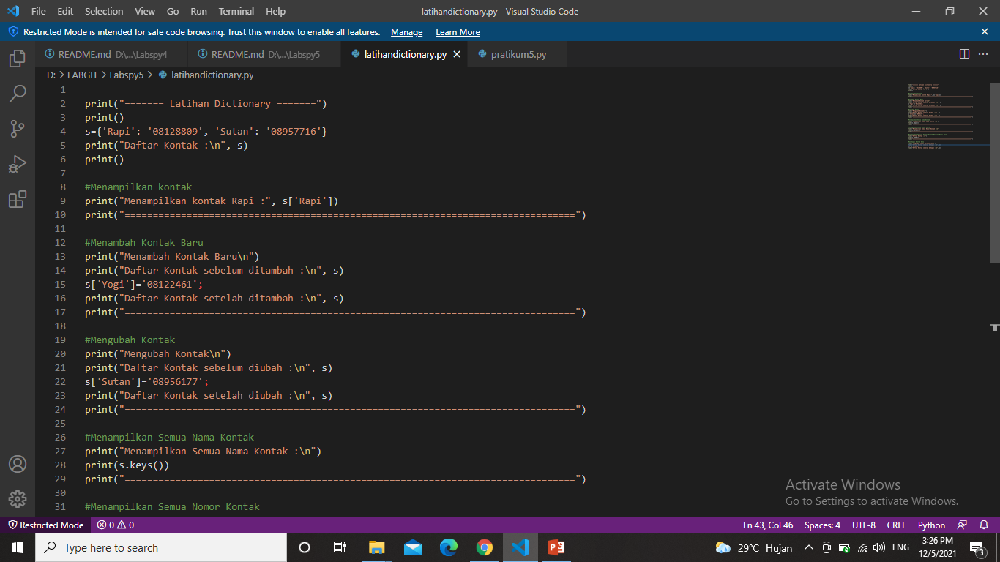
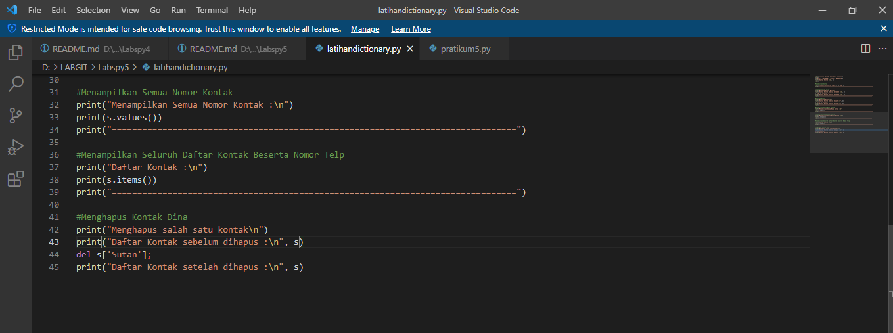
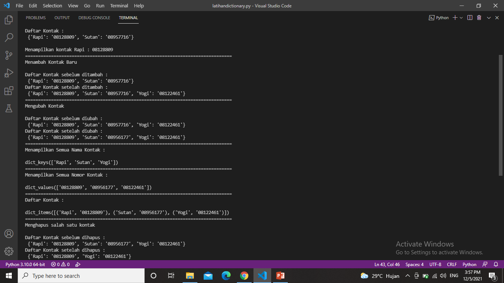
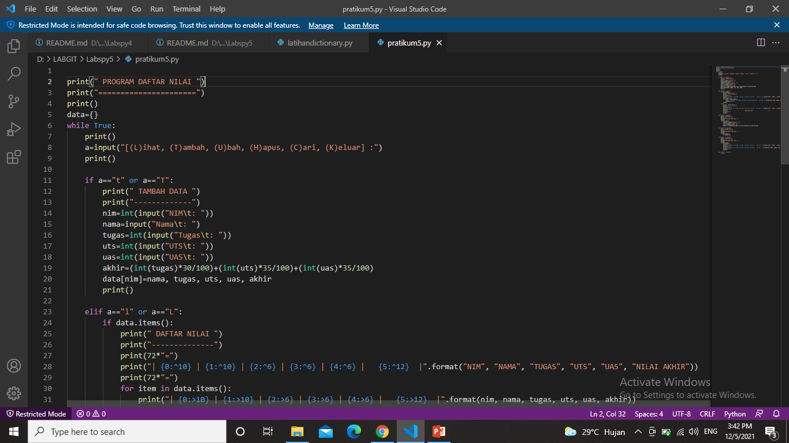
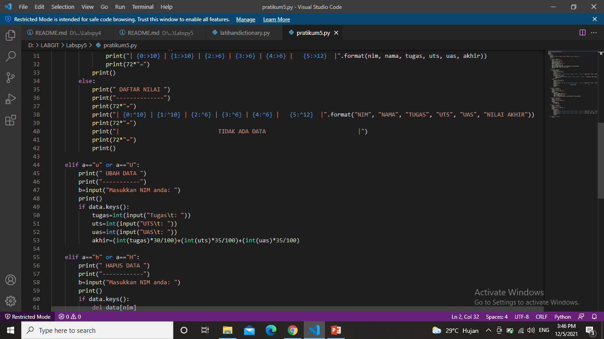
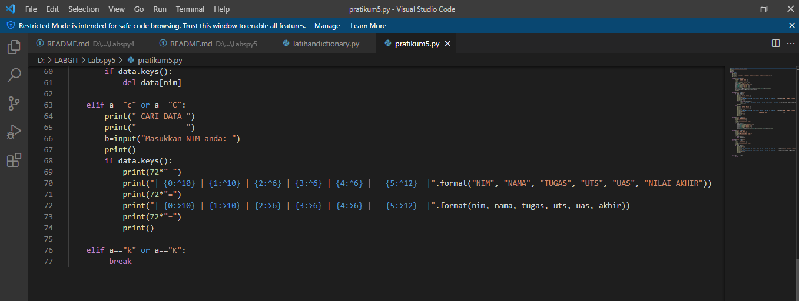
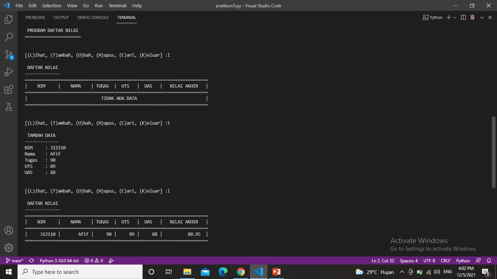
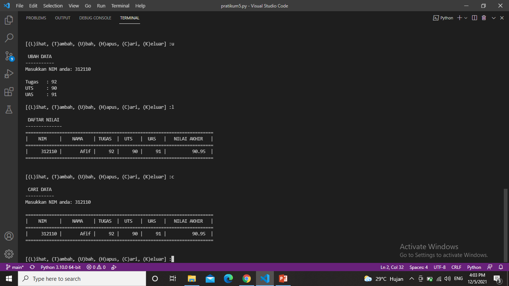

# Labspy5
## 1. Latihan : Dictionary
Dictionary adalah tipe data pada python yang berfungsi untuk menyimpan kumpulan data/nilai dengan pendekatan key-value. Setiap key dipisahkan dari value-nya oleh titik dua (:), sedangkan item dipisahkan oleh koma, dan semuanya tertutup dalam kurung kurawal {}. <p>

Dictionary sendiri memiliki dua buah komponen inti: <p>
1. Key merupakan nama atribut suatu item pada dictionary. <p>
2. Value adalah nilai yang disimpan pada suatu atribut. <p>

<li> Program </li>





<li> Penjelasan </li>
1. Membuat dictionary daftar kontak. <p>

```bash
s={'Rapi': '08128809', 'Sutan': '08957716'}
```

2. Untuk menampilkan salah satu kontak, gunakan s['Rapi']. s adalah variable dictionary, sedangkan ['Rapi'] adalah keys dari sebuah dictionary. <p>

```bash
print("Menampilkan kontak Rapi :", s['Rapi'])
```

3. Jika ingin menambahkan kontak baru gunakan variable_dictionary['keys']=value; . <p>

```bash
s['Yogi']='08122461';
```

4. Untuk mengubah kontak yang lama dengan yang baru, gunakan variable_dictionary['keys']=value;. Disini saya akan mengubah valuenya yang semula 'Sutan': '08957716' menjadi 'Sutan': '08956177'. <p>

```bash
s['Sutan']='08956177';
```

5. Untuk menampilkan semua nama kontak, gunakan keys(). <p>

```bash
print(s.keys())
```

6. Jika ingin menampilkan semua nomor kontak, gunakan values(). <p>

```bash
print(s.values())
```

7. Untuk menampilkan daftar kontak beserta nomor teleponnya, gunakan items(). <p>

```bash
print(s.items())
```

8. Untuk menghapus salah satu kontak, gunakan statement del variable_dictionary[keys]; . <p>

```bash
del s['Sutan'];
```

<li> Output </li>



## Tugas Pratikum 5
## 2. Tugas : Tampilkan Menu Pilhan (Tampilkan Data ,Tambah Data ,Ubah Data ,Hapus Data , Cari Data)

<li> Flowchart </li>

<li> Program </li>







<li> Penjelasan </li>
1. Membuat dictionary kosong yang nantinya akan diinput dengan data. <p>

```bash
data={}
```

2. Membuat perulangan dengan while dan terdapat pilihan menu untuk menjalankan program. <p>

```bash
while True:
print()
a=input("[(L)ihat, (T)ambah, (U)bah, (H)apus, (C)ari, (K)eluar] :")
print()
```

3. Menambahkan data nim, nama, nilai tugas, uts, dan uas. Data yang diinputkan akan masuk ke dalam dictionary data dengan nim sebagai keys sedangkan nama, tugas, uts dan uas sebagai values. <p>

```bash
if a=="t" or a=="T":
    print(" TAMBAH DATA ")
    print("-------------")
    nim=int(input("NIM\t: "))
    nama=input("Nama\t: ")
    tugas=int(input("Tugas\t: ")) 
    uts=int(input("UTS\t: "))
    uas=int(input("UAS\t: "))
    akhir=(int(tugas)*30/100)+(int(uts)*35/100)+(int(uas)*35/100)
    data[nim]=nama, tugas, uts, uas, akhir
```

4. Menampilkan atau melihat data. Jika sebelumnya belum menginput data, maka tampilannya akan "Tidak ada data". Apabila sudah menginput data, maka data yang telah diinput tadi akan ditampilkan. <p>

```bash
elif a=="l" or a=="L":
    if data.items():
        print(" DAFTAR NILAI ")
        print("--------------")
        print(72*"=")
        print("| {0:^10} | {1:^10} | {2:^6} | {3:^6} | {4:^6} |   {5:^12}  |".format("NIM", "NAMA", "TUGAS", "UTS", "UAS", "NILAI AKHIR"))
        print(72*"=")
        for item in data.items(): 
            print("| {0:>10} | {1:>10} | {2:>6} | {3:>6} | {4:>6} |   {5:>12}  |".format(nim, nama, tugas, uts, uas, akhir))
            print(72*"=")
        print()
    else:
        print(" DAFTAR NILAI ")
        print("--------------")
        print(72*"=")
        print("| {0:^10} | {1:^10} | {2:^6} | {3:^6} | {4:^6} |   {5:^12}  |".format("NIM", "NAMA", "TUGAS", "UTS", "UAS", "NILAI AKHIR"))
        print(72*"=")
        print("|                             TIDAK ADA DATA                           |")
        print(72*"=")
        print()
```

5. Apabila ingin mengubah data, maka anda akan diminta untuk menginputkan nim terlebih dahulu. Setelah itu input data yang ingin diubah. <p>

```bash
elif a=="u" or a=="U":
    print(" UBAH DATA ")
    print("-----------")
    b=input("Masukkan NIM anda: ")
    print()
    if data.keys():
        tugas=int(input("Tugas\t: ")) 
        uts=int(input("UTS\t: "))
        uas=int(input("UAS\t: "))
        akhir=(int(tugas)*30/100)+(int(uts)*35/100)+(int(uas)*35/100)
```

6. Jika ingin menghapus data, anda akan diminta untuk menginput nim. Lalu data yang telah diinput diawal tadi akan dihapus beserta valuesnya (nama, nilai tugas, nilai uts dan nilai uas). <p>

```bash
elif a=="h" or a=="H":
    print(" HAPUS DATA ")
    print("------------")
    b=input("Masukkan NIM anda: ")
    print()
    if data.keys():
        del data[nim]
```

7. Apabila ingin mencari data, anda akan diminta untuk menginput nim kemudian data yang anda cari akan muncul berdasarkan nim yang diinput tadi. <p>

```bash
elif a=="c" or a=="C":
    print(" CARI DATA ")
    print("-----------")
    b=input("Masukkan NIM anda: ")
    print()
    if data.keys():
        print(72*"=")
        print("| {0:^10} | {1:^10} | {2:^6} | {3:^6} | {4:^6} |   {5:^12}  |".format("NIM", "NAMA", "TUGAS", "UTS", "UAS", "NILAI AKHIR"))
        print(72*"=")
        print("| {0:>10} | {1:>10} | {2:>6} | {3:>6} | {4:>6} |   {5:>12}  |".format(nim, nama, tugas, uts, uas, akhir))
        print(72*"=")
        print()
```

8. Jika data sudah selesai diinput, pilih menu 'k'/'K' maka program akan terhenti. <p>

```bash
elif a=="k" or a=="K":
     break
```

<li> Output </li>





## Sekian Terima Kasih